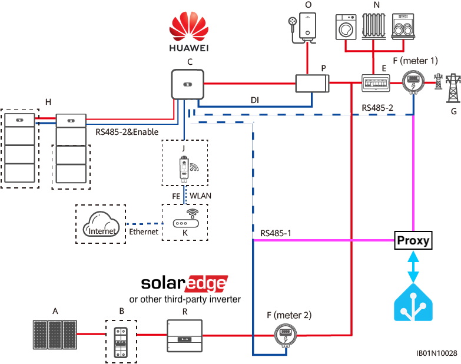
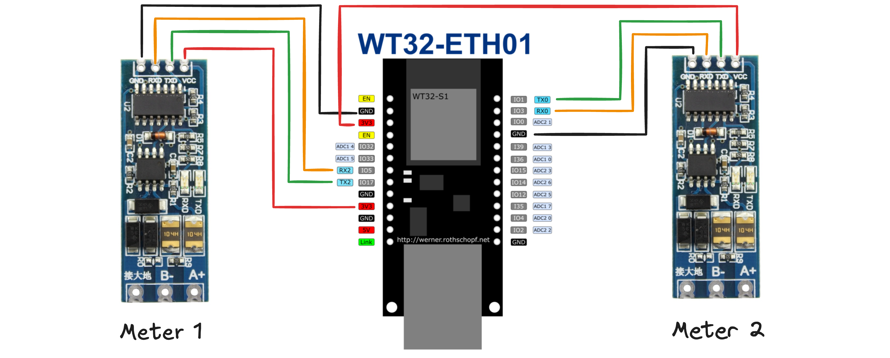

# ESPHome DSTU666-H Modbus Proxy
This project provides an ESPHome configuration to proxy Modbus requests from **Huawei Sun2000** inverters and simulate **DTSU666-H energy meters**. The data source for the simulation is Home Assistant, accessed via its API.

## Scenario
I have an existing SolarEdge solar system installed on my main roof, complemented by a Huawei system on my carport. Unfortunately, due to inaccurate measurements, you can't connect energy meters from both systems to the same grid connection. Thankfully, both systems support integration with third-party energy production systems. This allows accurate data to be shared across apps, web portals, and statistics. For more details, see [**Huawei's documentation**](https://support.huawei.com/enterprise/en/doc/EDOC1100167258/85f29830/networking-with-third-party-inverters) on networking with third-party inverters.

In this setup:

- **Energy Meter 1** simulates the main grid meter.
- **Energy Meter 2** simulates the meter for the third-party energy production system.

## Datasource
The simulated DTSU666-H energy meters retrieve their data from a local Home Assistant instance via its API.Home Assistant integrates:

- Live energy data from the SolarEdge energy meter connected to the main grid connection.
- Additional net meter data obtained from a local Tibber Pulse instance.

If you don't run Home Assistant, you can fetch the data directly from the SolarEdge inverter via Modbus TCP. Note, however, that SolarEdge inverters support only one Modbus TCP connection at a time, and additional connection attempts will be refused. You can fix this by using a dedicated Modbus TCP Proxy.

## Hardware
For enhanced reliability, this project uses the ESP32-WT32-ETH01 board with an Ethernet cable connection. However, any ESP32 board with Wi-Fi is compatible. Modbus communication is handled by using two TTL-to-RS485 boards.

## Configuration
To set up this project in your environment, you'll need to configure the following files:

- **secrets.yaml**: Add your credentials and secrets
- **em1_sensors.yaml**: Add/change the entities
- **em2_sensors.yaml**: Add/change the entities

## ⚠️ REGISTER BLOCK 2214 ⚠️
The Modbus register mappings for the H-Version of the DTSU666 are not comprehensively documented. However, during debugging of requests from the Huawei inverter, it was observed that the inverter queries **10 registers** starting from holding register **2214**.

The current implementation of the code does not result in any errors, indicating that the basic communication setup may be functional. However, there is still uncertainty about the specific values these registers are expected to contain.

If you have any insights or accurate documentation regarding the expected values for these registers, your contribution would be highly valuable to ensure precise functionality and interoperability.